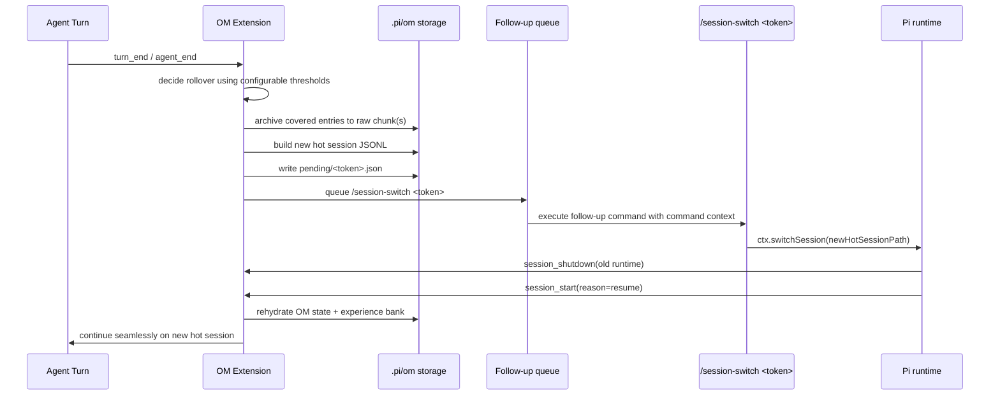

# Observational Memory vNext Plan

## Goal

Evolve `observational-memory` into a resumable, ever-evolving memory system that:

1. keeps the active **hot session** small enough to remain resumable,
2. preserves full provenance in a separate **raw archive**,
3. maintains an internal **experience bank** for extension-managed retrieval,
4. performs seamless post-turn rollover via `/session-switch <token>`, and
5. supports offline recovery of already-bloated sessions such as `ghostclaw-main`.

---

## Design principles

- **Do not rewrite the currently active Pi-bound session file in place.**
- **Do append OM state through Pi APIs.**
- **Do rebuild a fresh hot session file and switch to it safely.**
- **Do preserve the same session name across hot-session rollover.**
- **Do archive removed/full-fidelity history outside the active Pi session scan path.**
- **Do keep experience memory private to OM in v1**; no automatic `SKILL.md` publication.
- **All size thresholds are configurable.**

---

## Architecture diagram

```mermaid
flowchart TD
    subgraph PiRuntime[Pi Runtime]
        U[User / Agent Turn]
        OM[Observational Memory Extension]
        CMD[/session-switch <token>/]
        SS[Session Switch Command Handler]
        UI[Footer + Replay UI]
    end

    subgraph ActiveSession[Active Session Layer]
        SM[Active SessionManager\n(in-memory)]
        HOT[(Hot Session JSONL)]
    end

    subgraph OmProjectStore[Project-local .pi/om]
        PENDING[ pending/<token>.json ]
        RAW[ raw/<session-name-or-id>/chunk-*.jsonl ]
        EXPIDX[ experiences/index.json ]
        EXPITEMS[ experiences/items/E*.json ]
        REPORTS[ recovery/reports/*.json ]
    end

    subgraph OfflineTools[OM Recovery / Analysis Scripts]
        REPORT[session_report.py]
        RECOVER[recover_large_session.py]
        VALIDATE[validate_hot_session.py]
    end

    U --> OM
    OM -->|safe append via pi.appendEntry| SM
    SM --> HOT
    OM -->|before_agent_start / context retrieval| EXPIDX
    EXPIDX --> EXPITEMS
    EXPITEMS --> OM
    OM --> UI

    OM -->|turn_end / agent_end rollover build| RAW
    OM -->|create pending switch token| PENDING
    OM -->|queue follow-up slash command| CMD
    CMD --> SS
    SS -->|ctx.switchSession(targetHotSession)| SM

    REPORT --> HOT
    REPORT --> RAW
    RECOVER --> HOT
    RECOVER --> RAW
    VALIDATE --> HOT
    RECOVER --> REPORTS
```

---

## Runtime boundary diagram



---

## Storage model

### 1) Hot session
The session Pi actively resumes and appends to.

Contains:
- recent live tail,
- latest OM state/checkpoints,
- same human-facing session name,
- compact references to archived coverage,
- trimmed stubs for oversized workflow/tool-result payloads when necessary.

### 2) Raw archive
Project-local chunked provenance store under:

```text
.pi/om/raw/<session-name-or-id>/chunk-000001.jsonl
```

Contains:
- exact removed/cut history,
- exact oversized payloads removed from hot session,
- archived legacy giant sessions.

### 3) Experience bank
Project-local private memory store under:

```text
.pi/om/experiences/
```

Contains:
- candidate / active / merged / deprecated / trusted experiences,
- ranking and usefulness metrics,
- provenance by entry IDs,
- trigger patterns and tool names.

This bank is retrieved directly by OM and injected through extension-managed retrieval.

---

## Session naming policy

- The **new hot session keeps the same session name** as the current user-facing session.
- The previous giant/rolled session is moved out of active Pi session scanning and archived under `.pi/om/raw/...`.
- Example:
  - current user-facing session name: `ghostclaw-main`
  - new hot session name: `ghostclaw-main`
  - previous archived history: `.pi/om/raw/ghostclaw-main/chunk-000001.jsonl`

---

## Provenance model

Use **entry IDs only** as authoritative coverage references.

Example metadata shape:

```json
{
  "sourceSessionPath": "/Users/.../ghostclaw-main.jsonl",
  "sourceSessionName": "ghostclaw-main",
  "entryIdStart": "abc12345",
  "entryIdEnd": "xyz98765",
  "coveredEntryIds": ["abc12345", "...", "xyz98765"],
  "archiveChunkPath": ".pi/om/raw/ghostclaw-main/chunk-000007.jsonl"
}
```

---

## Configurable thresholds

Thresholds must be configurable via dedicated OM config, not hard-coded.

### Config precedence

1. OM built-in defaults
2. `~/.pi/agent/extensions/observational-memory/config.json`
3. `<project>/.pi/observational-memory.json`

`.pi/settings.json` remains for loading the extension and normal Pi settings, not as the primary OM threshold store.

### Proposed threshold keys

```json
{
  "sessionRollover": {
    "warnBytes": 157286400,
    "targetBytes": 209715200,
    "hardBytes": 262144000,
    "legacyRecoveryCandidateBytes": 314572800,
    "minProjectedSavingsBytes": 52428800
  },
  "oversizedEntries": {
    "entryBytes": 8388608,
    "stubPreviewChars": 1500,
    "trimWorkflowToolResults": true
  },
  "archive": {
    "targetChunkBytes": 67108864,
    "maxChunkBytes": 134217728
  }
}
```

### Threshold intent

- `warnBytes`: show UI warning and eagerly prepare rollover.
- `targetBytes`: preferred rollover threshold.
- `hardBytes`: force rollover at the next safe boundary.
- `legacyRecoveryCandidateBytes`: treat older sessions above this as recovery candidates.
- `entryBytes`: any single entry above this becomes an oversized-payload candidate for stubbing in the hot session.
- `minProjectedSavingsBytes`: avoid noisy rollovers that barely shrink the session.

### Default policy

- **Do not wait until ~400MB.**
- Default operating target should roll the hot session well before that danger zone.

---

## Legacy recovery path

This design must support recovery of already-bloated sessions like `ghostclaw-main`.

### Recovery strategy

1. Stream-parse the large source session.
2. Read latest session name / OM state / model / thinking metadata.
3. Determine OM-covered range by latest OM cursor.
4. Advance to a safe rebuild boundary.
5. Archive removed history to `.pi/om/raw/...`.
6. Trim oversized workflow/tool-result payloads into hot-session-safe stubs.
7. Build a fresh hot session.
8. Preserve the same session name.
9. Remove the original giant file from active Pi session scanning.
10. Validate the rebuilt hot session before resuming.

### Recovery scripts

These should live under:

```text
extensions/observational-memory/scripts/
```

Planned scripts:
- `recover_large_session.py`
- `session_report.py`
- `validate_hot_session.py`

---

## Experience bank model (v1)

### Decision

V1 uses an **internal experience bank only**.

No automatic export to `SKILL.md`.

### Why

- avoids prompt pollution,
- supports ranking/merging/trust,
- lets OM retrieve experiences privately,
- matches XSkill-style extension-managed retrieval.

### Experience states

- `candidate`
- `active`
- `merged`
- `deprecated`
- `trusted`

### Example record

```json
{
  "id": "E000042",
  "kind": "execution_tip",
  "text": "When bash output is long and filtering is likely, prefer rg/grep before rereading the full file.",
  "toolNames": ["bash", "grep", "rg"],
  "triggerPatterns": ["large output", "filtering", "search"],
  "status": "active",
  "score": 74,
  "rank": "high",
  "retrievedCount": 8,
  "appliedCount": 5,
  "helpedCount": 4,
  "hurtCount": 1,
  "ignoredCount": 3,
  "source": {
    "sourceSessionName": "ghostclaw-main",
    "entryIdStart": "abc123",
    "entryIdEnd": "xyz999",
    "coveredEntryIds": ["..."]
  },
  "supersedes": ["E000031"]
}
```

---

## Replay/debug UI

Upgrade `session-replay.ts` to visualize:

- user
- assistant
- tool calls/results
- OM state entries
- OM diagnostic entries
- archive boundaries
- rollover boundaries
- experience creation/update/merge/deprecation
- session-switch events

With:
- clear color legend,
- filters,
- hot/raw provenance visibility.

---

## File responsibilities

### Existing files to extend
- `extensions/observational-memory/index.ts`
- `extensions/observational-memory/config.ts`
- `extensions/observational-memory/types.ts`
- `extensions/observational-memory/footer.ts`
- `extensions/session-replay.ts`

### New OM files/directories
- `extensions/observational-memory/PLAN.md`
- `extensions/observational-memory/TASKS.md`
- `extensions/observational-memory/scripts/recover_large_session.py`
- `extensions/observational-memory/scripts/session_report.py`
- `extensions/observational-memory/scripts/validate_hot_session.py`
- `extensions/observational-memory/lib/` helpers for:
  - hot-session builder
  - raw archive writer
  - pending switch token management
  - experience bank management
  - recovery/validation utilities

---

## Acceptance criteria

This design is complete when:

1. hot sessions roll over before entering the danger zone,
2. `ghostclaw-main`-style legacy sessions can be recovered,
3. rollover preserves the same session name,
4. original huge files are archived out of active session scanning,
5. `/session-switch <token>` performs safe seamless switching,
6. thresholds are configurable,
7. replay/debug UI can show OM/archive/experience events,
8. OM uses an internal experience bank in v1.
